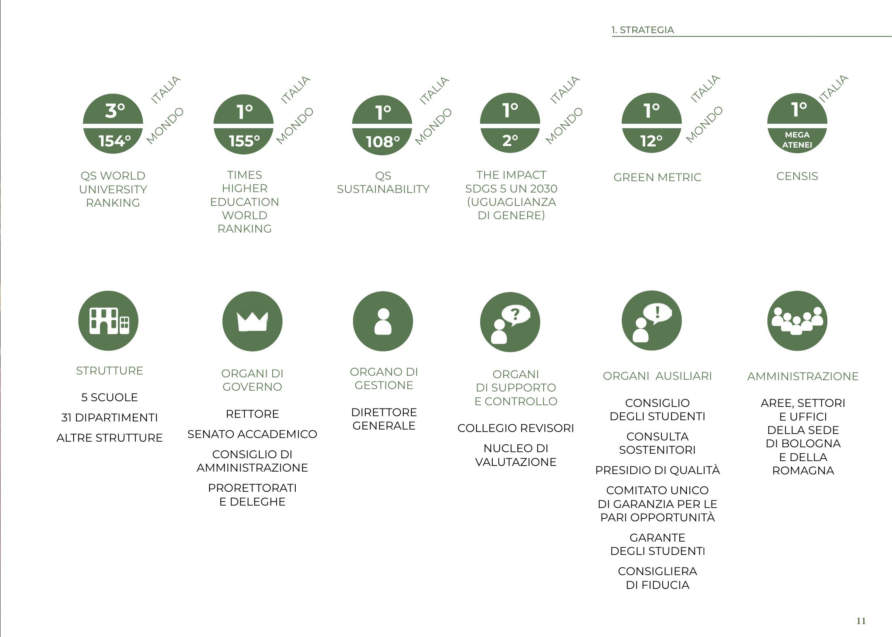
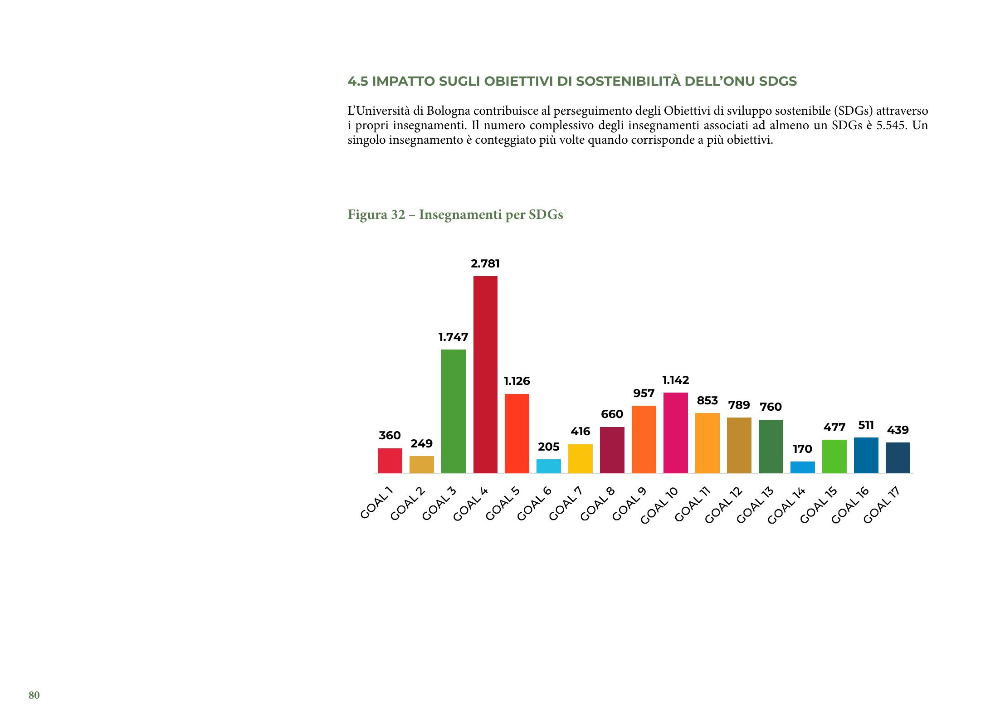

# PdfDataExtraction

A Python-based solution to extract structured data from complex PDF reports using LLMs like **Gemini 2 Flash** or local models via **Ollama**.

## Context

I was assigned the task of extracting data from a **Sustainability Report**, a large PDF (~228 pages) without any source files. The document is filled with **graphs, tables, charts, and infographics**, which contain valuable data.

Some examples:

  
  

## The Challenge

Manual data extraction wasn't an option due to the volume. Traditional OCR methods required deep technical knowledge and weren't easy to automatize. Even cloud-based solutions like **Azure** didn't offer anything tailored for such task.

## The LLM Approach

I turned to vision capable **LLMs**, and **ChatGPT (GPT-4o)** looked promising. Results were solid, although with limitations:

- LLMs sometimes **mislabel data** or swap labels due to formatting inconsistencies.
- Outliers or design quirks in infographics can confuse the model.

Despite the flaws, it worked well enough to pursue a bulk-processing solution. However, the **pay-as-you-go** pricing model put me off as I wasn't sure yet about this path.

That's when I discovered **Gemini 2 Flash by Google**, a competitive LLM with a generous **free API tier**:

- 15 requests/min
- 1500 requests/day

## On Privacy & Local Alternatives

Using Gemini 2 free tier means that data may be used to improve the model, which raises **privacy concerns**, especially with confidential documents.

To mitigate this, I explored **local LLM hosting** using a user-friendly, open-source tool called **Ollama** which:

- Supports a wide range of models
- Runs entirely offline
- Performs the best with a **GPU (8GB+ VRAM)**

While local models (like **Gemma 3** and **Llama3.2-vision**) don't match the commercial ones in quality, they're still usable, especially with better hardware than my own (i7-12700F, 16GB DDR4 RAM, RX 6600 8GB VRAM).

## Repository Purpose

This repo contains scripts that automate the process of extracting structured data from PDFs using **LLMs (cloud or local)**.

### Workflow Summary

1. Convert PDF pages into images (`.jpeg` is recommended).
2. Create a chapter index with page numbers (either manually or with the help of LLMs).
3. Feed each image to a vision-capable LLM (Gemini 2 or Ollama models).
4. Receive extracted JSON data per page.
5. Merge data into the structured index using page numbers.

---

## Convert a PDF to images
Run `python convert_pdf.py <pdf_path>` where `<pdf_path>` is the path of the target PDF.

>Requires `pdf2image` library which you can install with `pip install pdf2image`. `poppler` is also required, the details about its installation can be found at https://pypi.org/project/pdf2image

## Extracting data from a single image with Gemini 2
Run `python gemini_call.py <image_path> <output_folder_name> <Gemini_API_key>` where `<image_path>` is the path of the target image, `output_folder_name` is the name of the folder from the current working directory and `<Gemini_API_key>` is your personal Gemini 2 API key.

>Requires `google-genai` library which you can install with `pip install google-genai` as well as `pillow` which should come with `poppler` but can be installed with `pip install pillow`.

>Note: The prompt can be changed by editing the `PROMPT` variable in the script.

## Extract data from images in bulk
Run `python extract_data.py <image_folder_path> <output_folder_name> <Gemini_API_key>` where `<image_path>` is the path of the target image, `output_folder_name` is the name of the folder from the current working directory and `<Gemini_API_key>` is your personal Gemini 2 API key.

>Requires `google-genai` library which you can install with `pip install google-genai` as well as `pillow` which should come with `poppler` but can be installed with `pip install pillow`.

>Note: As of April 2025, Gemini 2 free tier allows up to 15 request per minute and 1500 requests per day. That may change in the future and you can easily tweak those values in the script.

## Complete an index file
Run `python fill_index.py <target_json> <pages_folder> <output_name>` where `<target_json>` is the path to the index file that needs to be filled, `<pages_folder>` is the folder containing the json files containing extracted data from a specific page and `<output_name>` is the name of the final output file in json format.

## Extract data from images with Ollama API
Run `python extract_data_with_ollama.py <images_folder> <start_index> <model>` where `<images_folder>` is the path of the folder containing the images from which to extract data, `<start_index>` is the index of the image from which to start (`0` means start from the first), assuming that the images are sorted numerically and `<model>` is the name of the model you pulled with Ollama.

>Requires `ollama` library which you can install with `pip install ollama`

>Note: The prompt can be changed by editing the PROMPT variable in the script.
Ollama must be running and the selected model must be downloaded.
Performance depends heavily on hardware. Larger models need more VRAM and memory.